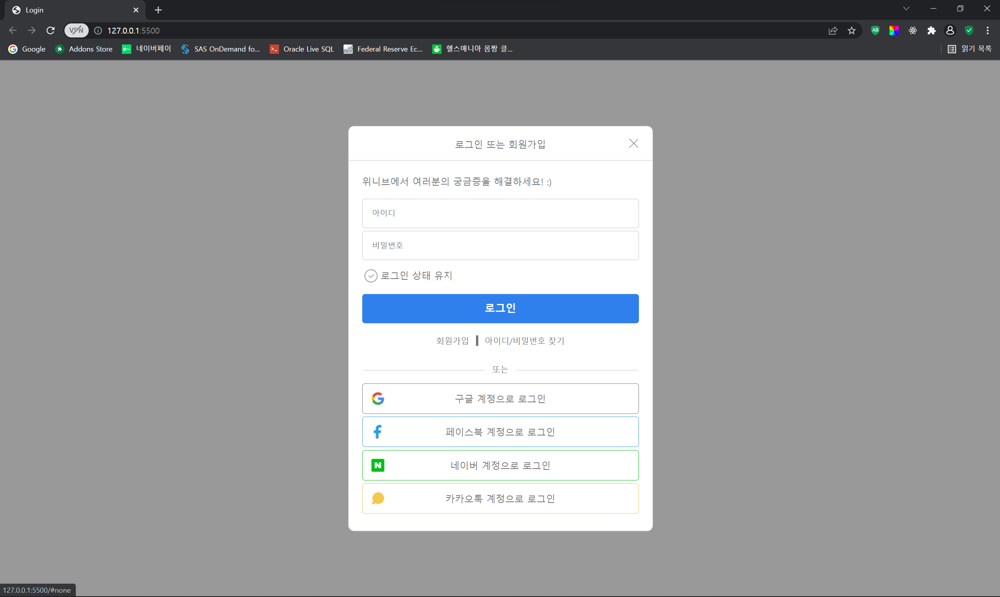
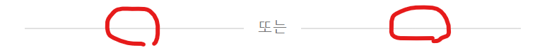
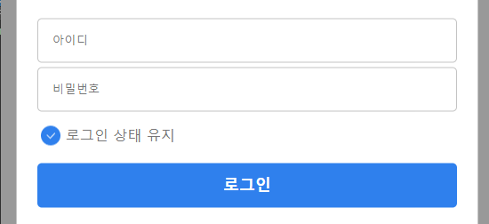
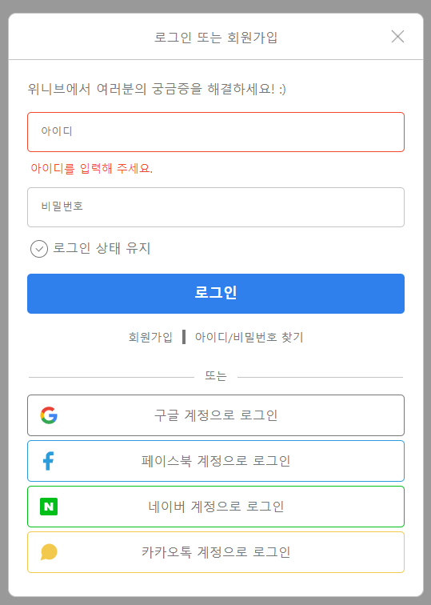
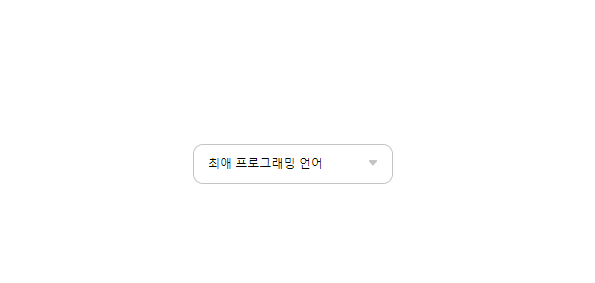
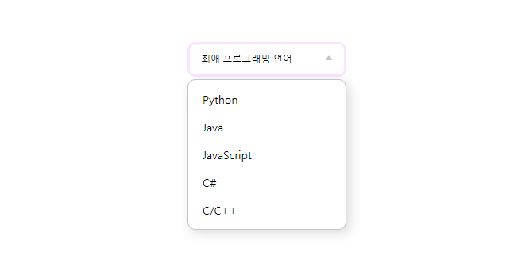
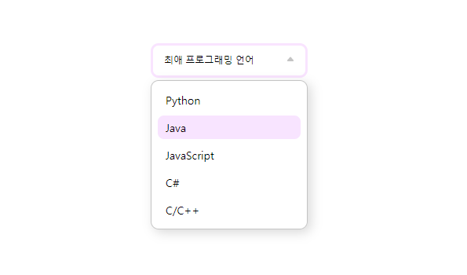
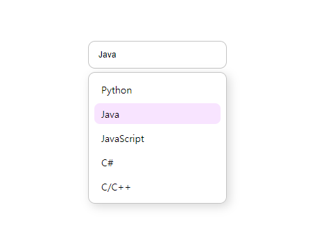

# weniv_login

- ## 사용한 기술 스택

  </a>&nbsp;
  </a>&nbsp;
  </a>&nbsp;

- ## 사이트 주소

  https://yoojs1205.github.io/weniv_login/

- ## 0411 (월)

  - 진행 상황

  1. 첫 로그인 페이지 퍼블리싱<br><br>
  <div align="center">
  
  </div>
  &nbsp;&nbsp;&nbsp;&nbsp;&nbsp;&nbsp;&nbsp;&nbsp;&nbsp;=> 시작 페이지

  2. 로그인 버튼 누르면 로그인 폼 모달창이 나오는 기능 구현<br>

     - hidden이라는 클래스를 만들어서 버튼 클릭 시 로그인 폼의 hidden 클래스를 제거하는 방식
     - 모달창이 열렸을 때 모달창 바깥 영역을 어둡게 설정

       ```css
       /* css */
       .hidden {
         display: none;
       }
       .dark {
         background-color: rgba(0, 0, 0, 0.4);
       }
       ```

       ```javascript
       // javascript
       const Body = document.querySelector("body");
       const StartForm = document.querySelector(".login-guide");
       const LoginButton = document.querySelector(".login");
       const LoginForm = document.querySelector(".login-form");
       const CloseButton = document.querySelector(".form-title img");

       LoginButton.addEventListener("click", () => {
         LoginForm.classList.remove("hidden");
         Body.classList.add("dark");
       });

       CloseButton.addEventListener("click", () => {
         LoginForm.classList.add("hidden");
         Body.classList.remove("dark");
       });
       ```

    <div align="center">
    
    </div><br>

  3. 로그인폼 퍼블리싱 (진행중)<br><br>

  - 개발 이슈

  1. 로그인 폼 제목 텍스트를 x버튼에 상관없이 가운데에 정렬시키기

     > #### 해결 방안<br>

     ```css
     .form-title {
       text-align: center;
       position: relative; /* 부모에 relative 속성 부여 */
       padding: 20px 0;
       border-bottom: 1px solid #c4c4c4;
     }

     .form-title span {
       width: 100%;
       margin: 0 auto; /* 텍스트 가운데 정렬 */
     }

     .form-title img {
       position: absolute; /* 버튼에 absolute 속성 부여 후 맨 오른쪽으로 이동 */
       right: 0;
       width: 16px;
       cursor: pointer;
     }
     ```

  2. padding이 양옆으로 들어간 요소에 padding을 무시하고 border 삽입하기<br>
     => 추후 해결 예정

- ## 0412 (화)

  - 진행 상황

    1. 로그인 폼 퍼블리싱<br><br>
    <div align="center">
    
    </div><br>
    => 시작페이지에서 로그인 버튼을 클릭할 시 나타나는 로그인 폼 구현<br>
    => 로그인 폼의 x 버튼 누르면 모달창이 사라지도록 구현<br>

  - 개발 이슈
    1. 가상 요소 선택자를 사용하는데에 문제가 있었음.
    <div align="center">
    
    </div><br>
    => 해당 요소를 가상 요소를 이용하여 구현하였다. 콘텐츠 사이에 margin을 주어야하는 상황인데, before, after **요소의 너비를 각각 50%를 주면 될것으로 생각**되었으나, 너비가 너무 넓어져 줄바꿈이 발생하였다.<br>
    => 현재는 margin을 부여하고 너비를 눈으로 보기에 맞도록 대충 설정해놓은 상태이다.<br><br>

- ## 0413 (수)

  - 진행 상황

    1. 로그인 상태 유지 클릭 시 색 변경하는 기능 구현<br>
       => 클릭 시 해당 요소의 src를 바꾸는 이벤트리스너를 통하여 구현

    ```javascript
    const Condition = document.querySelector(".login-condition");
    // 이벤트리스너
    Condition.addEventListener("click", (e) => {
      // 검은색의 이미지일때 클릭하면 푸른색 이미지로
      if (e.target.src === "http://127.0.0.1:5500/images/check-box.png") {
        e.target.setAttribute("src", "images/checked-box.png");
      }
      // 이외에는 다시 검은색 이미지로
      else {
        e.target.setAttribute("src", "images/check-box.png");
      }
    });
    ```

    <div align="center">
    
    </div><br>

    2. 아이디 입력창에 아무 값을 입력하지 않고 로그인 버튼을 누르면 경고창이 뜨고, 아이디 입력창의 border 색이 변경되는 기능 구현<br>
       => 아이디값을 이벤트리스너의 e.target.value로 지정하고, 값이 빈 값인 상태로 로그인 버튼이 눌릴 때 기능이 실행되도록 구현.

    ```javascript
    var idValue = "";
    const Id = document.querySelector(".id");
    const Login = document.queSelector(".content-login");
    // 이벤트리스너
    Id.addEventListener("change", (e) => {
      idValue = e.target.value;
    });
    Login.addEventListener("click", (e) => {
      const Warning = '<p class="warning">아이디를 입력해 주세요.</p>';
      if (idValue === "") {
        e.preventDefault();
        Id.style.borderColor = "#f4492e";
        Id.insertAdjacentHTML("afterend", Warning);
      }
    });
    ```

    <div align="center">
    
    </div><br>

  - ## 0414 (목)

    - 진행 상황

      1. SelectBox 퍼블리싱<br><br>
      <div align="center">
      
      </div><br>
      <div align="center">
      
      </div><br>
      <div align="center">
      
      </div><br><br>

      2. 기능 구현

      - 이벤트리스너를 사용해서 Select Box를 누르면 select 콘텐츠들이 나오도록 구현
      - 이벤트리스너를 사용해서 Select Box를 누르면 화살표 모양이 바뀌도록 이용<br>
      - 이벤트리스너를 사용해서 콘텐츠를 누르면 해당 텍스트가 Select Box에 나타나도록 구현

      ```javascript
      const SelectBox = document.querySelector(".select");
      const OptionBox = document.querySelector(".options");

      // e.target => 이벤트가 발생한 요소
      // e.currentTarget => 이벤트리스너를 호출시킨 요소
      SelectBox.addEventListener("click", (e) => {
        // 클릭 시 이미지 변경
        if (
          e.currentTarget.childNodes[1].src ==
          "http://127.0.0.1:5500/images/icon-Triangle-down.png"
        ) {
          e.currentTarget.childNodes[1].src =
            "http://127.0.0.1:5500/images/icon-Triangle-up.png";
        } else {
          e.currentTarget.childNodes[1].src =
            "http://127.0.0.1:5500/images/icon-Triangle-down.png";
        }
        // 클릭 시 하위 콘텐츠 보여주기, 가리기
        OptionBox.classList.toggle("hidden");
      });

      // 콘텐츠 선택하면 해당 텍스트가 나타나도록 구현
      OptionBox.addEventListener("click", (e) => {
        SelectBox.innerText = e.target.innerText;
      });
      ```

        <div align="center">
        
        </div><br><br>
