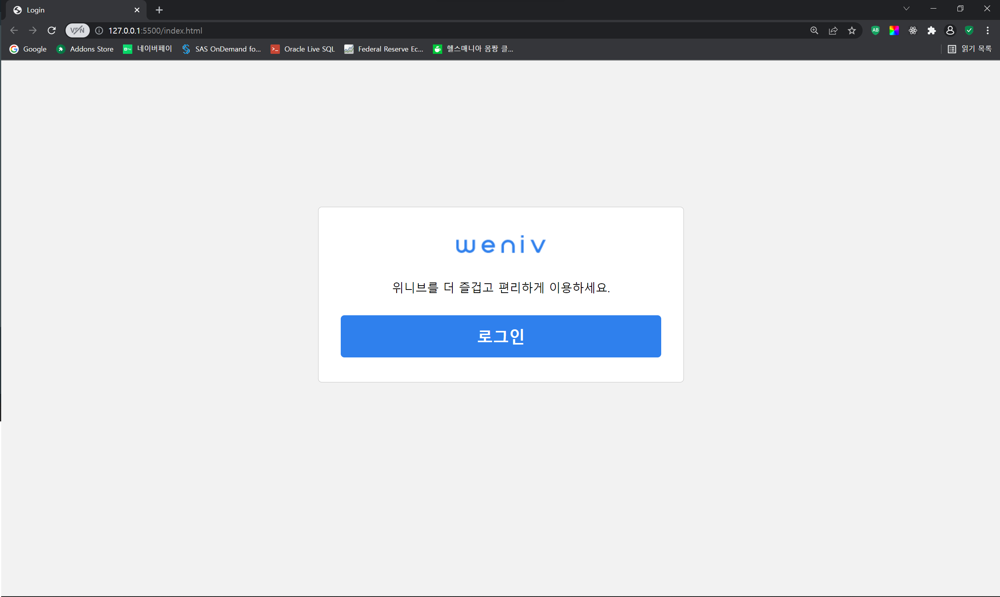
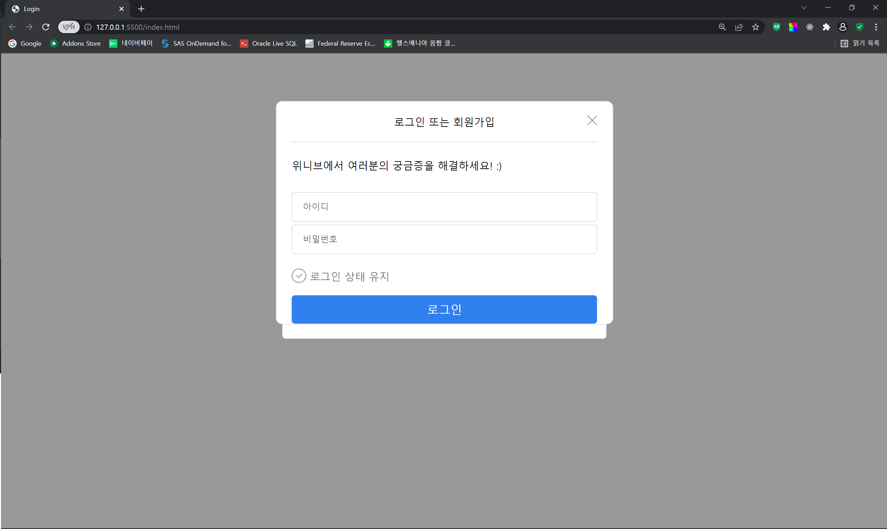

# weniv_login

- ## 사용한 기술 스택

  </a>&nbsp;
  </a>&nbsp;
  </a>&nbsp;

- ## 0411 (월)

  - 진행 상황

  1. 첫 로그인 페이지 퍼블리싱<br><br>
  <div align="center">
  
  </div>
  &nbsp;&nbsp;&nbsp;&nbsp;&nbsp;&nbsp;&nbsp;&nbsp;&nbsp;=> 시작 페이지

  2. 로그인 버튼 누르면 로그인 폼 모달창이 나오는 기능 구현<br>

     - hidden이라는 클래스를 만들어서 버튼 클릭 시 로그인 폼의 hidden 클래스를 제거하는 방식
     - 모달창이 열렸을 때 모달창 바깥 영역을 어둡게 설정

       ```css
       /* css */
       .hidden {
         display: none;
       }
       .dark {
         background-color: rgba(0, 0, 0, 0.4);
       }
       ```

       ```javascript
       // javascript
       const Body = document.querySelector("body");
       const StartForm = document.querySelector(".login-guide");
       const LoginButton = document.querySelector(".login");
       const LoginForm = document.querySelector(".login-form");
       const CloseButton = document.querySelector(".form-title img");

       LoginButton.addEventListener("click", () => {
         LoginForm.classList.remove("hidden");
         Body.classList.add("dark");
       });

       CloseButton.addEventListener("click", () => {
         LoginForm.classList.add("hidden");
         Body.classList.remove("dark");
       });
       ```

    <div align="center">
    
    </div><br>

  3. 로그인폼 퍼블리싱 (진행중)<br><br>

  - 개발 이슈

  1. 로그인 폼 제목 텍스트를 x버튼에 상관없이 가운데에 정렬시키기

     > #### 해결 방안<br>

     ```css
     .form-title {
       text-align: center;
       position: relative; /* 부모에 relative 속성 부여 */
       padding: 20px 0;
       border-bottom: 1px solid #c4c4c4;
     }

     .form-title span {
       width: 100%;
       margin: 0 auto; /* 텍스트 가운데 정렬 */
     }

     .form-title img {
       position: absolute; /* 버튼에 absolute 속성 부여 후 맨 오른쪽으로 이동 */
       right: 0;
       width: 16px;
       cursor: pointer;
     }
     ```

  2. padding이 양옆으로 들어간 요소에 padding을 무시하고 border 삽입하기<br>
     => 추후 해결 예정
